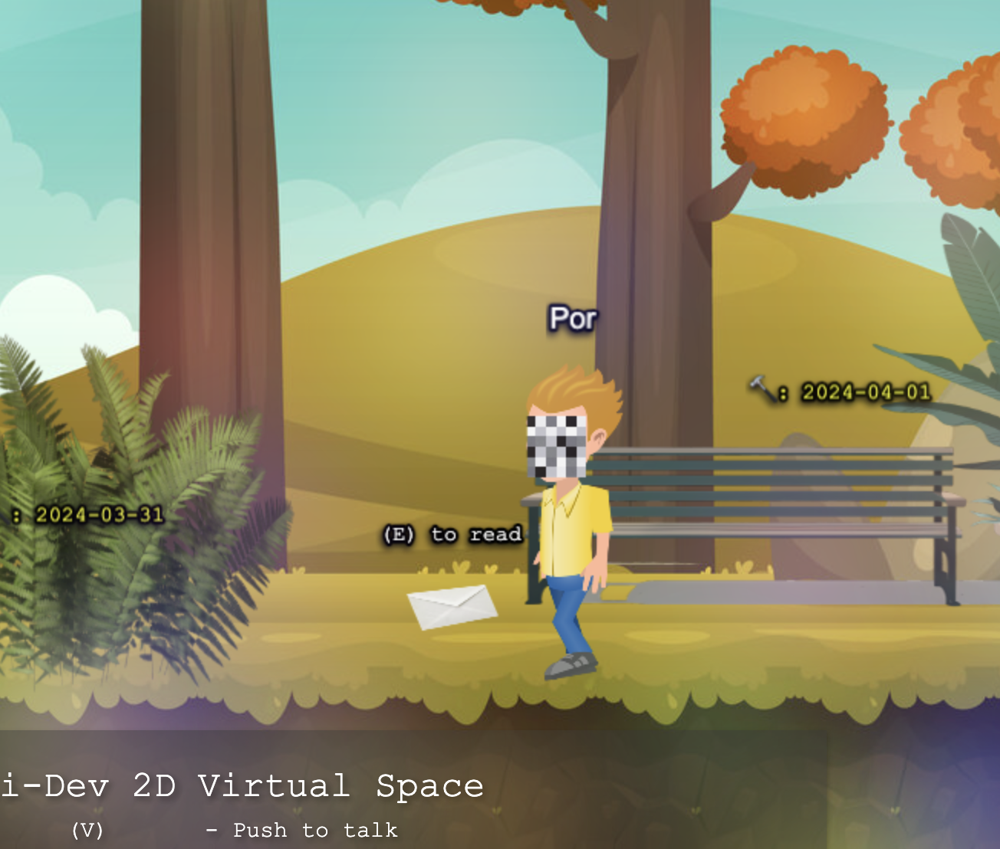
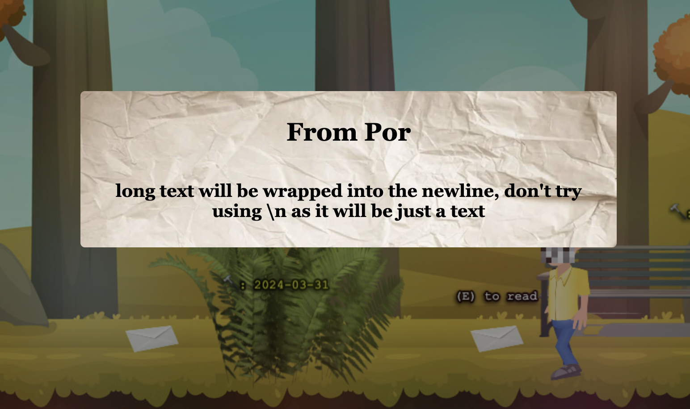

## Description

🌟 Welcome to 2dRTChat! 🚀

2dRTChat is an exciting venture into the realm of virtual worlds, where users can immerse themselves in a 2D game environment and connect with others through voice chat technology. The project is still in development, but here's a sneak peek into what it will offer:

### Virtual Space

🎮 Experience a vibrant 2D game world built with Pixi.js, a powerful rendering engine for creating captivating graphics. Explore this immersive virtual space filled with endless possibilities and adventures!

### Voice Chat

🎤 Connect with friends and fellow explorers through seamless voice chat powered by WebRTC technology. Communicate in real-time, share stories, and coordinate your adventures together!

    

### Dynamic terrain

🌲 Dynamic terrain generation based on how much Thiti-Dev contributed to github in the last 30days

    

### Envelop

Ability to leave messages or "envelopes" in the virtual world. If I am available, I will check these messages out and interact with them, creating a dynamic and interactive communication experience within the virtual space.

    
     

---

## Purpose

🎯 The purpose of this project is to provide a unique and immersive platform for social interaction in a virtual space. As someone who isn't often active on social media and finds it challenging for people around me to reach out, I wanted to create a space where friends and acquaintances could connect with me in a more engaging and personal way. Through this virtual world, I aim to foster meaningful connections and create memorable experiences for everyone involved.

---

## Technology Used

### Pixi.js

🎨 Pixi.js is a cutting-edge rendering engine that brings stunning visuals to life in our virtual space. With its high-performance graphics rendering capabilities, we can create rich and immersive environments that captivate the imagination.

### MobX

🔄 MobX is our go-to state management library, ensuring that our application's state remains organized and efficient. With MobX, we can easily manage complex state interactions and keep our virtual world running smoothly.

### WebRTC

🔊 WebRTC technology powers our voice chat feature, enabling seamless communication between users in real-time. With WebRTC, we can ensure high-quality audio streaming and synchronization, providing a truly immersive social experience.

---

## Future Feature

### Artifact Creation

💎 Donation feature. Support the 2dRTChat and leave your mark by donating! Donors will have the opportunity to have their own artifact or house created in the 2D game world, adding a personal touch to the virtual landscape.

---

🚧 **Please note:** This project is still in development, and we're working hard to bring you the best virtual space experience possible. Stay tuned for updates and get ready to embark on an unforgettable journey in our 2D game world!

---
